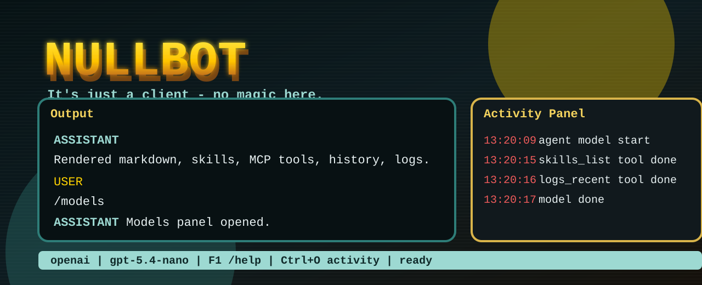

# NullBot



`NullBot` is a local, Go-built bot client with a fast Bubble Tea TUI, a tinychain agent loop, and a deliberately small built-in tool surface.

> It's just a client - no magic here.

NullBot is designed to feel like a real local assistant without quietly becoming a shell, editor, browser, email client, or file-munching goblin. Those capabilities are meant to arrive through explicit MCP tool servers that the user chooses to install.

## What It Does

| Area | Capability |
| --- | --- |
| TUI | Rich terminal layout with output and activity panels, scrollable modals, multiline input, mouse wheel scrolling, retro configurable banner text, and Markdown-rendered assistant output. |
| Chat | Talks to configured model providers through tinychain, with OpenAI/OpenRouter-style model selection and local provider settings. |
| Activity | Streams model and tool activity live into the activity panel so you can see what the bot is doing before the final answer lands. |
| Config | Stores app settings in `~/.nullbot/config.json` and API keys in `~/.nullbot/api/keys.json`. |
| Skills | Reads installed `SKILL.md` files and includes a built-in `create_skill` tool that can write one skill or a batch of skills into safe subdirectories. |
| History | Persists chat history to `~/.nullbot/history`, keeps recent context compact, and lets the bot inspect recent or prior session history through constrained tools. |
| Logs | Writes runtime logs to `~/.nullbot/logs/nullbot.log` and exposes recent log lines to the bot through a constrained built-in tool. |
| MCP | Lists configured MCP servers and cached market packages; external powers are expected to come from separate MCP binaries. |
| Safety | No built-in arbitrary shell, code editing, email, browser, or broad filesystem access. Add those only through explicit MCP tooling. |

## Quick Start

Run it:

```powershell
go run ./cmd/nullbot
```

Build a Windows executable:

```powershell
go build -o nullbot.exe ./cmd/nullbot
```

Use a local development app directory:

```powershell
$env:NULLBOT_APP_DIR='.appdata'
go run ./cmd/nullbot
```

## Slash Commands

| Command | What it opens or does |
| --- | --- |
| `/help` | Opens the help modal without adding the command to the chat output. |
| `/config` | Opens editable config and API key fields. |
| `/models` | Opens provider/model selection, grouped by provider when keys are available. |
| `/mcp` | Shows configured MCP servers. |
| `/market` | Shows cached MCP market packages. |
| `/skills` | Shows installed skills. |
| `/history` | Opens recent persisted session history. |
| `/logs` | Opens recent runtime logs. |
| `/plan` | Opens or updates the plan view. |
| `/analyze` | Runs an analysis pass, optionally with a focus. |
| `/compact` | Compacts visible chat/tool history, optionally with a focus. |
| `/also` | Injects extra guidance into the active workflow. |
| `/pause` | Requests cancellation of active work without losing current visible state. |
| `/copy` | Copies the last assistant output. |
| `/clear` | Clears the output panel. |
| `/reset` | Resets the visible conversation state. |
| `/files` | Shows workspace/editor info; use `/files workspace <path>` to set the active workspace. |
| `/ls`, `/dir`, `/rm`, `/rmdir` | Built-in workspace file operations. Heavy reads, edits, search, and commands still come from explicit MCP tools. |

## Keybinds

| Key | Action |
| --- | --- |
| `F1` | Open help. |
| `Ctrl+Q` | Quit. |
| `Ctrl+C` | Pause active work when busy. |
| `Ctrl+J` | Insert a newline. |
| `Ctrl+V` | Paste from clipboard. |
| `Ctrl+A` | Select all input; the next typed or pasted text replaces it. |
| `Ctrl+Z` | Clear current input. |
| `Ctrl+K` | Clear output area. |
| `Ctrl+L` | Clear activity panel. |
| `Ctrl+O` | Open full activity log. |
| `Home` / `End` | Jump to the start or end of input. |
| `PageUp` / `PageDown` | Scroll output. |
| `Shift+Up` / `Shift+Down` | Scroll activity. |
| `Mouse wheel` | Scroll the panel or modal under the pointer. |

## App Data Layout

```text
~/.nullbot/
  api/
    keys.json
  artifacts/
    *.md
  config.json
  history/
    *.jsonl
  logs/
    nullbot.log
  market/
    index.json
  mcp/
  skills/
    nullbot-basics/
      SKILL.md
```

## Built-In Tooling

NullBot gives the model a small, local-only toolset by default:

| Tool | Scope |
| --- | --- |
| `config_dir_list` | Lists files inside the NullBot app directory. |
| `config_dir_read` | Reads small UTF-8 files inside the app directory. |
| `skills_list` | Lists installed `SKILL.md` files. |
| `create_skill` | Writes safe skill subdirectories under the skills directory. |
| `history_recent` | Returns compact recent visible messages. |
| `history_sessions` | Lists persisted session files. |
| `history_session_read` | Reads a compact tail of a selected persisted session. |
| `logs_recent` | Reads recent NullBot log lines. |
| `market_list` | Lists cached MCP market packages. |
| `mcp_list` | Lists configured MCP servers. |

## Development

NullBot depends on sibling local modules from `tinychain`. From this repository:

```powershell
go test ./...
go build -o nullbot.exe ./cmd/nullbot
```

The current priority is a tiny, auditable local client. Fancy powers should live in separate MCP servers so the default binary stays small and understandable.
